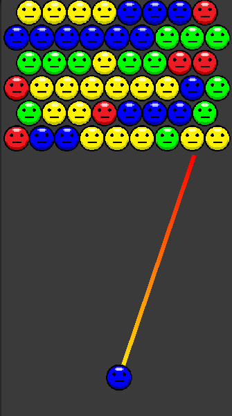

## BubblePop

### TODO

- [ ] 마우스를 클릭한채로 움직이면, 현재 의 중심점으로부터 움직인 각도만큼
- [ ] 만약에 정해진 위치에 알맞지 않은 각도로 오면 보간을 해서 알맞은 각도로 쏘게끔 ~~먼저 쏘고 위치정리 하는게 아님~~
- [ ] 같은 색깔 버블 연속 세개부터 터지기 시작함
- [ ] 버블판을 일일히 배치를 해야할까? 버블 판을 손쉽게 만들수 있는 방식도 생각하면 좋겠다.
- [ ] 버블판 메이커를 통해 만든 버블판은 json 형태로 파일이 저장되어도 좋을듯

